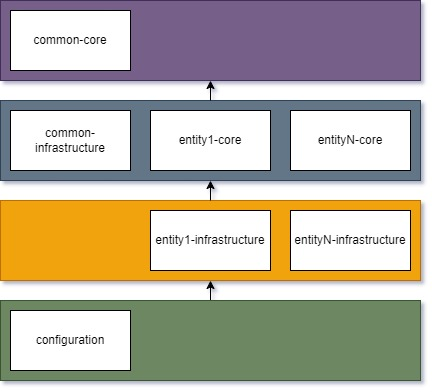

# Clean Architecture
This project is an implementation of a ReST API using principles from Robert Martin's books <i>Clean Code</i> and <i>Clean Architecture</i>.
 
## Modules
This project defines architectural boundaries to establish five distinct modules. For each new entity we would add two new modules: `<entity>-core` and `<entity>-infrastructure`, such as order-core and order-infrastructure. This approach allows us to easily extract entities into separate independent projects as the application matures or have separate service deployments. And as the application will be approaching the end of its life cycle, it can be easily merged back into one project and deployed as one service. The project is also partitioned into `core` and `infrastructure` modules, where `core` modules do not have any dependencies on frameworks, nor database and web technologies.

### Hierarchy
Components only depend on components in higher levels.

### common-core
Contains:
* Domain entities (DTOs), e.g. Customer, Order, Item.
* Definitions of use cases (interfaces for clients to interact with entities and for entities to interact with each other), e.g. create, update, search.
* Classes common across core modules, e.g. exceptions, pagination, validation tools.

### \<entity\>-core
Contains:
* Implementations of use cases defined in the common-core module.
* Definitions of gateway operations needed to manage entities, e.g. save, search by ID.

### common-infrastructure
Contains:
* Infrastructure related code common for multiple entities, such as exception handlers and Spring's pagination to our pagination converters.
* Error response model for ReST API.
The reason why this code is not in the `configuration` module is because `<entitiy>-infrastructure` modules depend on this module.

### \<entity\>-infrastructure
Contains:
* Entry points to perform operations on \<entity\>, such as ReST APIs defined in `Spring Controllers`.
* Data store accessors, such as `Spring JPA`.
* Implementations of gateway operations defined in the `<entity>-core` module.

### configuration
Contains:
* Configurations for project.
* The `main` method, since this is a Spring Boot app it is the `@SpringBootApplication` annotation.
